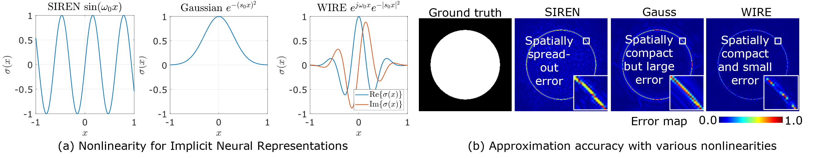

# MINER: Multiscale Implicit Neural Representation



**Abstract**: *We propose a new nonlinearity for implicit neural representations (INRs) based on the continuous complex Gabor wavelet that has high representation capacity for visual signals. (a) visualizes two commonly used nonlinearities: SIREN with sinusoidal nonlinearity and Gaussian nonlinearity, and WIRE that uses a continuous complex Gabor wavelet. WIRE benefits from the frequency compactness of sine, and spatial compactness of a Gaussian nonlinearity. (b) shows error maps for approximating an image with strong edges. SIREN results in global ringing artifacts while Gaussian nonlinearity leads to compact but large error at edges. WIRE produces results with the smallest and most spatially compact error. This enables WIRE to learn representations rapidly and accurately, while being robust to noise and undersampling of data.*

**Paper**: https://arxiv.org/abs/

## Instructions

### Data
Download image and occupancy examples from [here](https://www.dropbox.com/sh/qhesdb7shqa7rdt/AADQqMNCQ120VJGawX2of8nTa?dl=0). Place it in `path/to/this/folder/data/`. 
### Requirements
check `requirements.txt`. This code was tested on python 3.8 in both Windows and Linux environments. Requirements file generated in Linux environment but should work similarly in a Windows environment. Memory consumption statistics work only in Linux environment.
### Denoising images with WIRE
Check `wire_image_denoise.py` for denoise an image. We have included an example image  from div2k in `data/parrot.png`. 

### Representing pointclouds with WIRE
Check `wire_pointcloud.py` for fitting a 3D shape with occupancy information. For simplicity, we have included occupancy volume of Thai statue with regular sampling over 512x512x512 cube. 

### Multi-image super-resolution with WIRE
Check `wire_multi_sr.py` for performing super-resolution with multiple images captured with small motion between the frames. We have included an example image `data/kodak.png` for this script.

### Computed tomographic reconstruction with WIRE
Please check `wire_ct.py` for reconstructing images from computed tomographic measurements. We have included an example image `data/chest.png`.

### Information about individual files
1. `wire_image_denoise.py` **coming soon**: Runs training script for a single image
2. `wire_pointcloud.py` **coming soon**: Runs training script for a uniformly sampled occupancy of a 3D shape
3. `wire_multi_sr.py` **coming soon**: Runs training script for solving multi-image super-resolution
3. `wire_ct.py` **coming soon**: Runs training script for solving the computed tomography problem
3. `requirements.txt`: All requirements for running scripts in this folder
4. `modules`: Contains functions to run the training scripts:

    a. `lin_inverse.py`: Includes forward operator for computed tomography

    b. `models.py`: Contains definitions of several models including positional encoding, SIREN, and Gaussian nonlinearity

    c. `motion.py`: Contains functions for handling multi-image super resolution data generation

    d. `utils.py`: Miscellaneous utilities

    e. `volutils.py`: Utilities for handling volume signals

    f. `wire.py`: Contains definitions for implementing WIRE.

## Cite

```
@inproceedings{saragadam2022wire,
  title={WIRE: Wavelet Implicit Neural Representations},
  author={Saragadam, Vishwanath and LeJeune, Daniel and Tan, Jasper and Balakrishnan, Guha and Veeraraghavan, Ashok and Baraniuk, Richard G},
  booktitle={arXiv preprint arXiv:2301.05187}
  year={2022}
}
```

